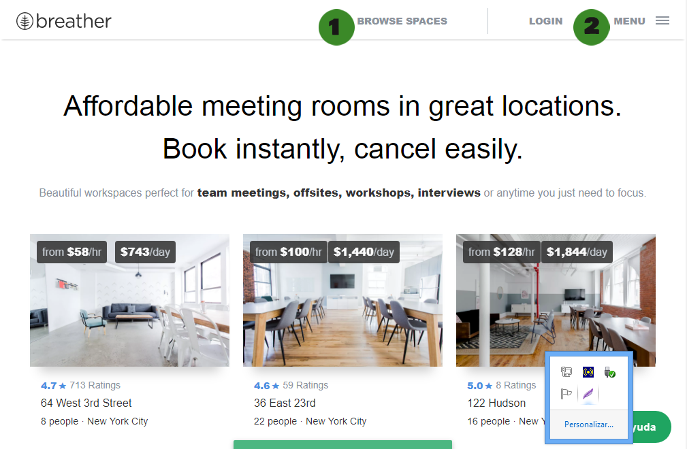
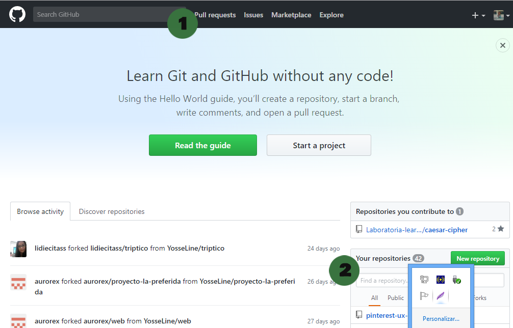
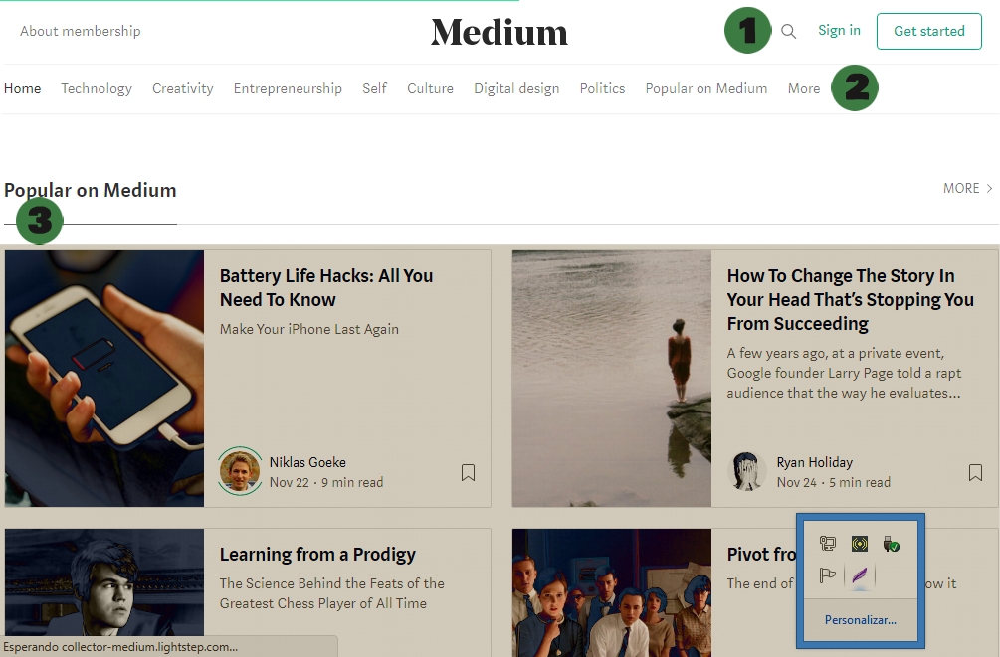

# IDENTIFICANDO LOS ELEMENTOS DE NAVEGACIÓN.

* **Reto**
* **Alumna:** Yosseline Apcho Huaman.

***

## Objetivo:

 Nuestra "misión" será identificar los distintos elementos de navegación que se encuentran en las páginas web que se mencionarán más adelante.

***

## Screenshot de Breather:

## Explicando...

1.  Navegación facetada.

Porque nos está mostrando una navegación a través de filtros no editables, definidos previamente por el sistema.

2. Navegación global.

Porque es la navegación principal de la página web.

***

## Screenshot de Github:

## Explicando...

1. Navegación global.

2. Navegación local.

***

## Screenshot de Medium:

## Explicando...

1. Navegación global.

2. Navegación facetada.

3. Navegación Contextual y Facetada.

Conetxual porque nos está mostrando las noticias más populares, sus trending. Facetada porque, no podemos modificar la información, son filtros no editables.
